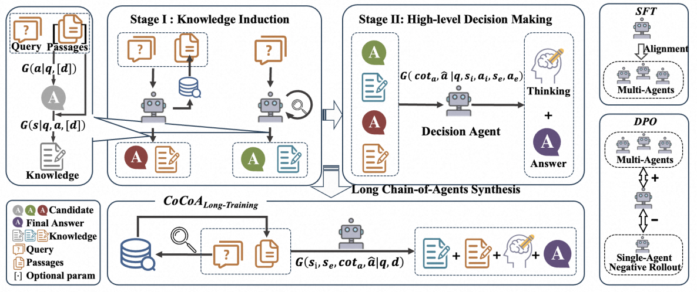

<div align="center">

# CoCoA: Collaborative Chain-of-Agents for Parametric-Retrieved Knowledge Synergy

<p align="center">

  <a href="https://arxiv.org/pdf/2508.01696">
    
  </a>
</p>
</div>


<div align="center">


**CoCoA Framework**:The top part is CoCoA-zero, a multi-agent collaboration framework. It integrates internal and external knowledge in a collaborative manner by first performing knowledge induction and then making decisions. 
The bottom part is the training strategy, which is based on CoCoA-zero and combines the trajectories of different agents into long chains to train and enhance the integration ability of the LLM.
</div>


**Details will be completed soon ...**


## 🛠 Installation


<details>
<summary>
The main dependencies are torch 2.5.1, vllm 0.7.3, DeepSpeed, trl, peft, faiss/faiss-gpu.
</summary>

```bash
conda create -n CoCoA python=3.9.18
conda activate CoCoA
pip install -r requirements.txt
```
</details>


## 💡 Preparation
***Download Corpus & Index***

<details>
<summary>
Retrieval is performed on the set of Wikipeda passages used in DPR. Download passages:
</summary>

```bash
wget https://dl.fbaipublicfiles.com/dpr/wikipedia_split/psgs_w100.tsv.gz
```
</details>

<details>
<summary>
Download passage embeddings pre-computed with Contriever or Contriever-msmarco:
</summary>
    
```bash
wget https://dl.fbaipublicfiles.com/contriever/embeddings/contriever/wikipedia_embeddings.tar
wget https://dl.fbaipublicfiles.com/contriever/embeddings/contriever-msmarco/wikipedia_embeddings.tar
```
</details>

<details>
<summary>
Retrieve top-k passages:
</summary>
  
```bash
cd ./retrieval
python retrieval_engine.py # Remember to configure your parameters
```
</details>


## 🎯 Train LLM
<details>
<summary>
Training
</summary>
  
```bash
cd scripts
bash xxx.sh # You can view the scripts provided in the scripts directory
```
</details>


## 📈 Run Evaluation
<details>
<summary>
 Download Evaluation Data:
</summary>
  
[HotpotQA](https://hotpotqa.github.io/), [2WikiMultiHopQA](https://github.com/Alab-NII/2wikimultihop), [WebQuestions](https://nlp.stanford.edu/software/sempre/), [TriviaQA](http://nlp.cs.washington.edu/triviaqa/)
</details>


Details will be completed soon


## Citation
```bibtex
@article{jiang2025collaborative,
  title={Collaborative Chain-of-Agents for Parametric-Retrieved Knowledge Synergy},
  author={Jiang, Yi and Zhao, Sendong and Li, Jianbo and Wang, Haochun and Zhang, Lizhe and Liu, Yan and Qin, Bin},
  journal={arXiv preprint arXiv:2508.01696},
  year={2025}
}
```

Thanks for your interest in our work!


